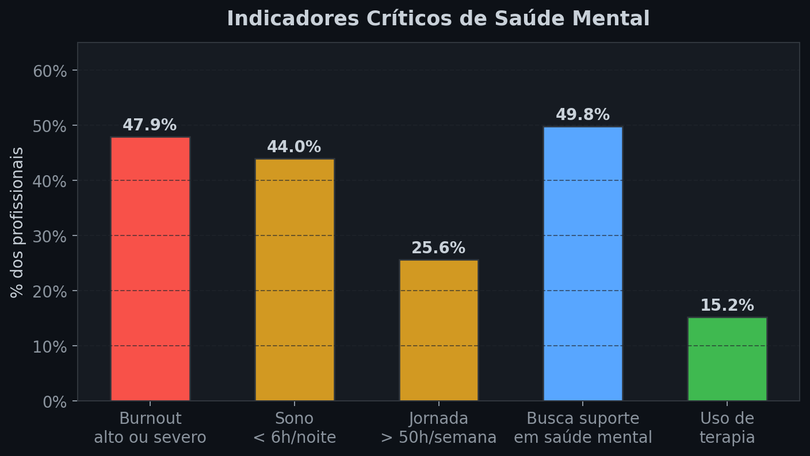
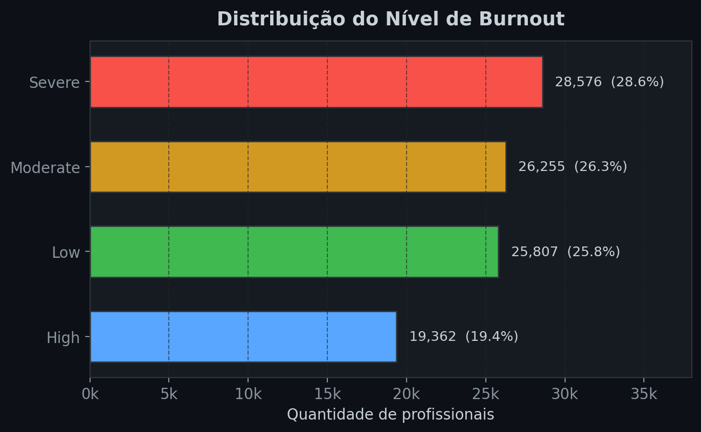
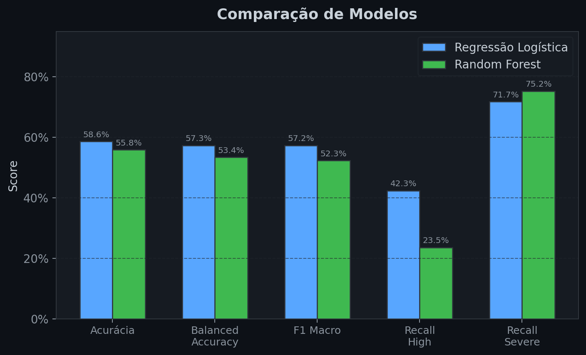
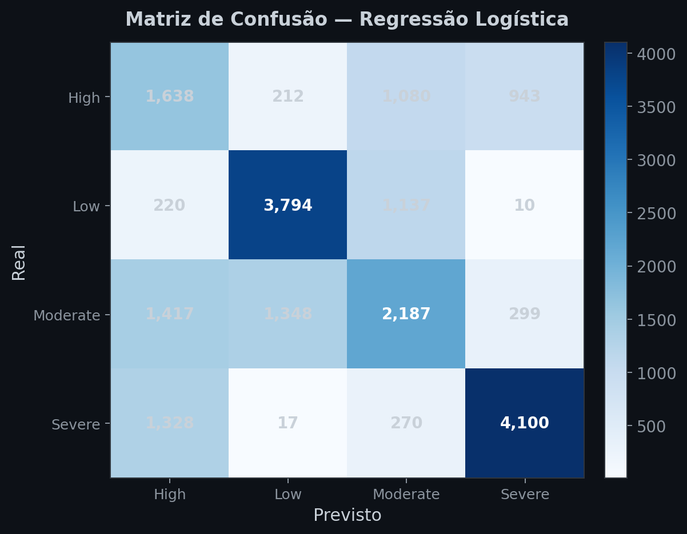
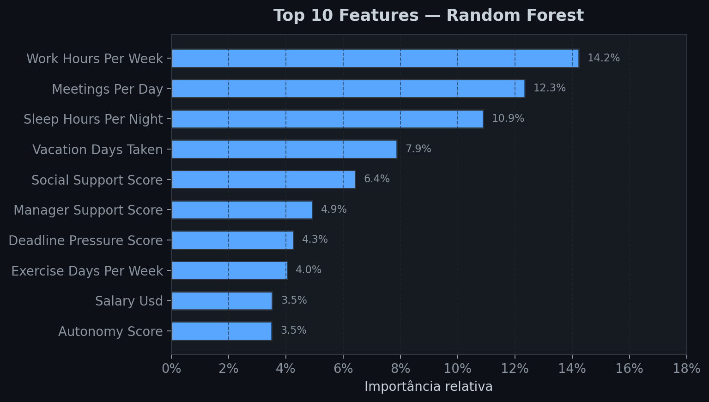

# Burnout & Saude Mental em Profissionais de Tecnologia

Pipeline completo de **ETL, analise estatistica, dashboard interativo e Machine Learning** sobre o dataset `mental_health_burnout_tech_2026.csv` (100 mil registros, 36 variaveis).

O projeto investiga fatores associados ao burnout em profissionais de tecnologia e constroi um modelo preditivo para classificar o nivel de burnout (`Low`, `Moderate`, `High`, `Severe`).

---

## Stack

| Camada | Tecnologia |
|---|---|
| Banco de dados | PostgreSQL 17 |
| Linguagem | Python 3.12 |
| ETL e analise | Pandas, NumPy, SciPy, SQLAlchemy, psycopg |
| Machine Learning | scikit-learn, joblib |
| Visualizacao | Plotly, Streamlit |
| Infraestrutura | Docker, Docker Compose |

## Estrutura do projeto

```text
.
├── app/
│   └── streamlit_app.py          # Dashboard interativo Streamlit
├── data/
│   └── mental_health_burnout_tech_2026.csv
├── docs/                          # Documentacao completa de cada etapa
├── outputs/
│   ├── statistics/                # CSVs, JSONs e Markdowns estatisticos
│   ├── dashboard/                 # Dashboard HTML e graficos Plotly
│   └── ml/                        # Artefatos de Machine Learning
├── scripts/
│   ├── import_data.py             # Importacao do CSV para tabela bruta
│   ├── clean_data.py              # Limpeza, constraints e validacoes
│   ├── db.py                      # Conexao com PostgreSQL
│   ├── statistical_analysis.py    # Estatisticas descritivas e KPIs
│   ├── dashboard_visual.py        # Graficos Plotly e dashboard HTML
│   ├── define_ml_problem.py       # Definicao do problema de ML
│   ├── prepare_ml_data.py         # Preparacao treino/teste
│   ├── train_first_model.py       # Regressao Logistica Multiclasse
│   ├── train_second_model.py      # Random Forest Classifier
│   └── compare_models.py          # Comparacao e selecao do melhor modelo
├── sql/
│   ├── 01_create_raw_table.sql    # DDL da tabela bruta
│   └── 02_create_clean_table.sql  # DDL da tabela tratada + constraints
├── .env.example                   # Modelo de variaveis de ambiente
├── docker-compose.yml             # Orquestracao completa do pipeline
├── Dockerfile                     # Imagem Python dos scripts e Streamlit
└── requirements.txt               # Dependencias Python
```

## Inicio rapido

### Pre-requisitos

- [Docker](https://www.docker.com/) e Docker Compose instalados.

### 1. Configurar variaveis de ambiente

```powershell
Copy-Item .env.example .env
```

### 2. Construir as imagens

```powershell
docker compose build
```

### 3. Executar o pipeline de dados

```powershell
docker compose up dashboard-export --abort-on-container-exit --exit-code-from dashboard-export
```

Esse comando executa automaticamente a cadeia:

```text
postgres → import-data → clean-data → statistical-analysis → dashboard-export
```

### 4. Subir o dashboard Streamlit

```powershell
docker compose up -d streamlit
```

Acesse em **http://localhost:8501**.

### 5. Parar os servicos

```powershell
docker compose down
```

Para remover tambem o volume do banco:

```powershell
docker compose down -v
```

---

## Execucao local (sem Docker para os scripts)

```powershell
python -m venv .venv
.\.venv\Scripts\Activate.ps1
pip install -r requirements.txt

# Subir apenas o PostgreSQL
docker compose up -d postgres

# Executar scripts na ordem
python scripts/import_data.py
python scripts/clean_data.py
python scripts/statistical_analysis.py
python scripts/dashboard_visual.py
python scripts/define_ml_problem.py
python scripts/prepare_ml_data.py
python scripts/train_first_model.py
python scripts/train_second_model.py
python scripts/compare_models.py

# Subir o dashboard
streamlit run app/streamlit_app.py
```

---

## Etapas do projeto

| Passo | Descricao | Documentacao |
|:---:|---|---|
| 1 | Compreensao do dataset | [`docs/01_compreensao_dataset.md`](docs/01_compreensao_dataset.md) |
| 2 | ETL: extracao, transformacao e carga | [`docs/02_etl.md`](docs/02_etl.md) |
| 3 | Analise estatistica descritiva | [`docs/03_analise_estatistica.md`](docs/03_analise_estatistica.md) |
| 4 | Dashboard visual (Plotly + Streamlit) | [`docs/04_dashboard_visual.md`](docs/04_dashboard_visual.md) |
| 5 | Definicao do problema de ML | [`docs/05_definicao_ml.md`](docs/05_definicao_ml.md) |
| 6 | Preparacao dos dados para ML | [`docs/06_preparacao_ml.md`](docs/06_preparacao_ml.md) |
| 7 | Primeiro algoritmo — Regressao Logistica | [`docs/07_primeiro_algoritmo.md`](docs/07_primeiro_algoritmo.md) |
| 8 | Segundo algoritmo — Random Forest | [`docs/08_segundo_algoritmo.md`](docs/08_segundo_algoritmo.md) |
| 9 | Comparacao dos algoritmos | [`docs/09_comparacao_algoritmos.md`](docs/09_comparacao_algoritmos.md) |
| 10 | Conclusao final | [`docs/10_conclusao_final.md`](docs/10_conclusao_final.md) |

---

## Principais descobertas

| Indicador | Valor |
|---|---:|
| Registros analisados | 100.000 |
| Idade media | 31,31 anos |
| Salario medio | USD 83.285 |
| Jornada semanal media | 47,10 h |
| Sono medio por noite | 6,10 h |
| Burnout alto ou severo | 47,94% |
| Profissionais com +50 h semanais | 25,63% |
| Profissionais com -6 h de sono | 43,99% |
| Uso de terapia | 15,19% |
| Uso diario de IA | 73,01% |

### Indicadores criticos



### Distribuicao do nivel de burnout



## Resultado de Machine Learning

**Variavel-alvo:** `burnout_level` (classificacao multiclasse)

| Modelo | Acuracia | Balanced Acc. | F1 Macro | Recall High | Recall Severe |
|---|---:|---:|---:|---:|---:|
| **Regressao Logistica** | 0,5859 | 0,5730 | 0,5722 | 0,4229 | 0,7174 |
| Random Forest | 0,5583 | 0,5337 | 0,5228 | 0,2355 | 0,7522 |

**Melhor modelo:** Regressao Logistica Multiclasse — maior F1 macro, balanced accuracy e recall para a classe `High`, alem de ser mais interpretavel e leve.

### Comparacao visual dos modelos



### Matriz de confusao — Regressao Logistica



### Top 10 features — Random Forest



---

## Variaveis de ambiente

| Variavel | Descricao | Padrao |
|---|---|---|
| `POSTGRES_DB` | Nome do banco | `mental_health_tech` |
| `POSTGRES_USER` | Usuario | `mental_health_user` |
| `POSTGRES_PASSWORD` | Senha | `mental_health_password` |
| `POSTGRES_HOST` | Host do banco | `localhost` |
| `POSTGRES_PORT` | Porta do PostgreSQL | `5432` |
| `RAW_TABLE` | Tabela bruta | `raw_mental_health_burnout_tech_2026` |
| `CLEAN_TABLE` | Tabela tratada | `clean_mental_health_burnout_tech_2026` |
| `CSV_PATH` | Caminho do CSV | `data/mental_health_burnout_tech_2026.csv` |
| `STREAMLIT_SERVER_PORT` | Porta do Streamlit | `8501` |

## Servicos Docker

| Servico | Tipo | Finalidade |
|---|---|---|
| `postgres` | Persistente | Banco PostgreSQL |
| `import-data` | Job | Importacao do CSV |
| `clean-data` | Job | Limpeza e validacao |
| `statistical-analysis` | Job | Estatisticas e KPIs |
| `dashboard-export` | Job | Dashboard HTML e graficos |
| `ml-problem-definition` | Job | Definicao do problema de ML |
| `ml-data-preparation` | Job | Preparacao treino/teste |
| `train-first-model` | Job | Regressao Logistica |
| `train-second-model` | Job | Random Forest |
| `compare-models` | Job | Comparacao e selecao |
| `streamlit` | Persistente | Dashboard interativo |

---

## Limitacoes

- Dataset aparentemente sintetico — pode nao representar integralmente o mundo real.
- Ausencia de dados temporais — nao permite avaliar evolucao do burnout.
- Variaveis clinicas removidas do baseline para evitar vazamento de dados.
- Classes intermediarias (`High`, `Moderate`) apresentaram pior desempenho nos modelos.

## Melhorias futuras

- Testar Gradient Boosting, XGBoost, LightGBM ou CatBoost.
- Ajuste de hiperparametros com validacao cruzada.
- Cenario clinico-operacional incluindo `stress_score`, `phq9_score` e `gad7_score`.
- Auditoria de fairness por `gender`, `country` e faixa etaria.
- Explicabilidade com SHAP.
- Automatizacao do pipeline em CI/CD.
