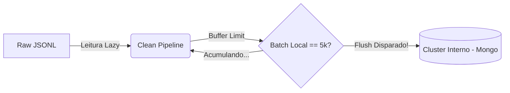

# 🛠️ Decisões Técnicas e Arquitetura

Para garantir uma solução corporativa que não sofresse degradação estrutural e para assegurar que qualquer desenvolvedor conseguisse colaborar localmente, aplicamos algumas decisões robustas de Software, profundamente inspiradas em Data Engineering.

### 🐳 1. Dockerização Subjacente do Cluster
Para evitar o problema estrutural clichê de *"na minha máquina funciona"*, containerizamos o ambiente do cluster de banco de dados desde a origem de sua concepção. A infraestrutura do projeto roda em instâncias **MongoDB 7.x** transparentes acopladas na porta `27017` e mapeadas a volumes hostizados (`mongo_data`) persistentes. A destruição inadvertida de containers é totalmente perdoada sem a fragmentação de seu histórico já ingressado.

### ⚡ 2. Processamentos Escaláveis em Streaming (Leitura Passiva)
> [!TIP]
> Processar bases colossais exige uma transição de paradigma imutável: Da alocação ansiosa para o carregamento pacífico (lazy evaluation).

No núcleo original de saneamento (`src/clean_data.py`), aplicamos uma varredura rigorosa lendo o arquivo atonomicamente `linha-a-linha`. Assim prevemos não explodir a alocação de seu repositório de memórias lendo subitamente assombrosos **~900MB** de texto e seus aproximados ~16 milhões de transações. Para escalabilidade profissional, também optamos por distribuir processamentos Spark através de DataFrames com `src/spark_pipeline.py`.

### ⚡ 3. Algoritmos Indexadores de Checagem Rápida (`Sets`)
Decidimos usar estrategicamente as clássicas abstrações de **Tabelas de Espalhamento (Hash Tables)** representadas nativamente pelo ambiente Python através dos conjuntos `Sets`. Anexamos nestas matrizes os hashes únicos (`IDs` limpos) atingindo velocidades operacionais de busca classificadas em um amortizado e fantástico viés computacional $O(1)$. Limpar mais de uma dezena de milhões de relacionamentos sob coleções de `Equipe`, para confrontá-los aos seus pares pais, se tornou determinístico.

### 📦 4. Ingestões Estratégicas através de Lotes (Batches)
Operar comandos como transacionar um insert por momento em (`db.collection.insert_one()`) cria pontes lógicas massivas de entrada e saída, corrompendo gravemente o paralelismo nativo da máquina host por fadiga de Socktes com o MongoClient. Optamos pela estruturação interativa através de coleções pré-alocadas de buffers contendo um limite fixo (Batch de `5.000` arrays por viagem). Reduzimos em 5.000 vezes as passagens de redes na transação da instrução acelerada via `insert_many(ordered=False)`.

#### Ilustração do Roteamento de Batch e Desligamento Paralelo no Pipeline Original:

